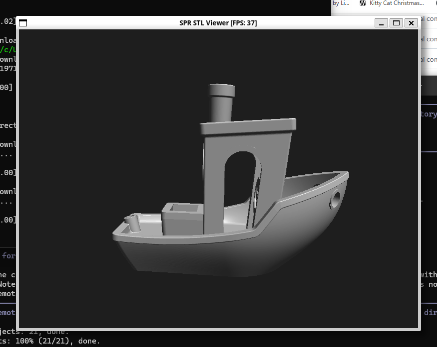

# Simple Polygon Renderer (SPR) & STL Viewer



A minimalist, single-file C library for software-based 3D rendering, accompanied by a fully functional interactive STL viewer.

## Features

### SPR Library (`spr.h` / `spr.c`)
*   **Zero Dependencies**: Relies only on the standard C library (`stdlib.h`, `math.h`, `string.h`).
*   **Programmable Pipeline**: Support for custom **Vertex** and **Fragment** shaders.
*   **Features**:
    *   3D Math (Matrices, Vectors via stack).
    *   Transform Stack (Push/Pop, ModelView/Projection).
    *   Perspective Correct Rasterization.
    *   Depth Buffering (Z-buffer).
    *   Clipper (Near plane rejection).
*   **Output**: Renders to a raw 32-bit RGBA buffer.

### STL Viewer (`viewer.c`)
*   **Interactive**: Real-time orbit, pan, and zoom controls using **SDL2**.
*   **Format Support**: Loads both Binary and ASCII `.stl` files.
*   **Shading**: Implements a "Plastic" shader with specular highlights.

## Prerequisites

*   **GCC** (or any standard C compiler)
*   **SDL2 Development Libraries** (only for the viewer)
    *   *Debian/Ubuntu*: `sudo apt install libsdl2-dev`
    *   *Fedora*: `sudo dnf install SDL2-devel`

## Building

### 1. Build the STL Viewer
```bash
gcc viewer.c spr.c stl.c -o viewer $(sdl2-config --cflags --libs) -lm
```

### 2. Build the Standalone Test (No SDL required)
Generates a `output_final.ppm` image without opening a window.
```bash
gcc test.c spr.c -o test_spr -lm
```

## Usage

### Running the Viewer
```bash
./viewer stl/bracket.stl
```

**Controls**:
*   **Left Mouse Drag**: Rotate (Orbit)
*   **Right Mouse Drag**: Pan
*   **Mouse Wheel**: Zoom
*   **'f' Key**: Toggle FPS display

## Project Structure

*   `spr.h` / `spr.c`: The core renderer library.
*   `stl.h` / `stl.c`: STL file loader.
*   `viewer.c`: Interactive viewer application using SDL2.
*   `test.c`: Minimal test suite for the library.
*   `docs/`: Development plans and documentation.
